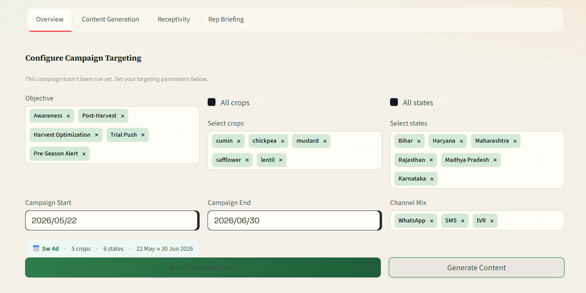
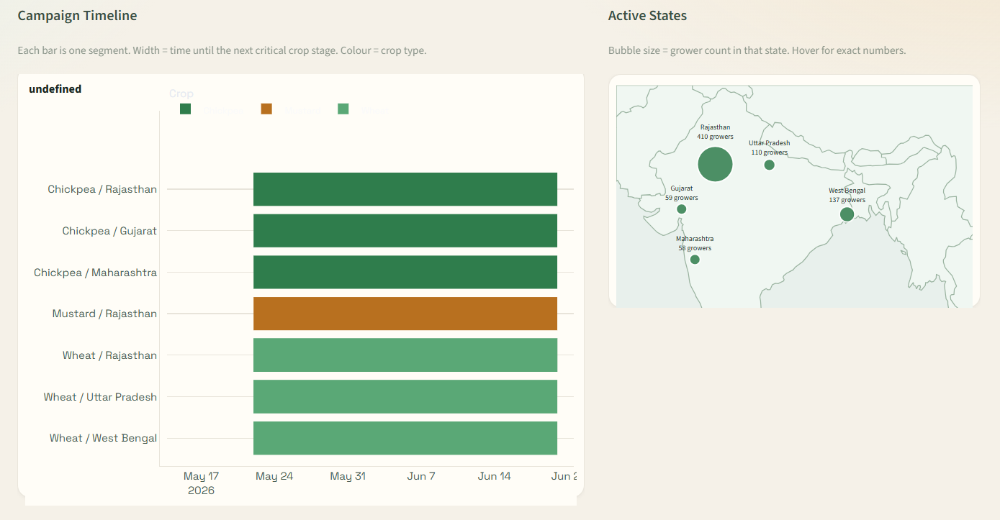
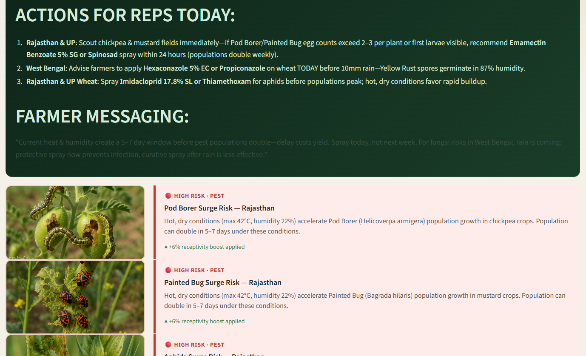
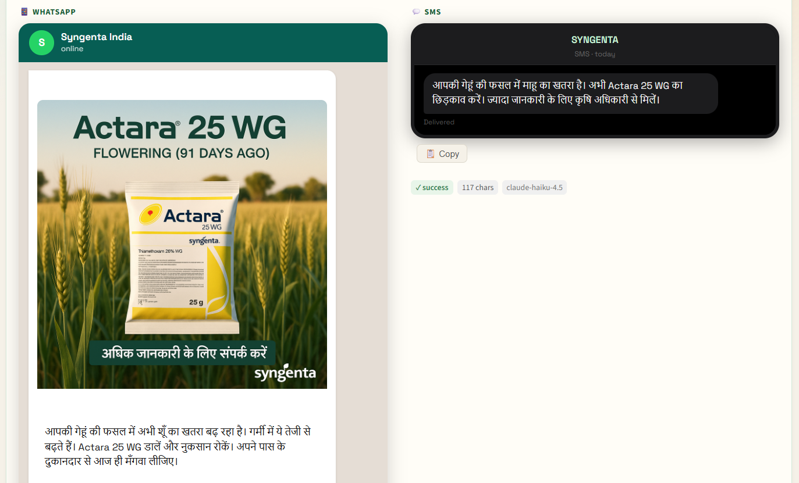

# 🌾 Krishi Pracharak

> AI-Native Agricultural Marketing Platform · Syngenta × IITM Hackathon 2026

Krishi Pracharak ("Farm Advocate") turns raw field data into hyper-local campaign decisions, multilingual content, and ranked field-rep actions — all from a single operational flow.

---

## Screenshots

### Configure Campaign Targeting

Set objectives, crops, states, date range, and channel mix — the AI targeting agent scores all 6,000 growers and returns prioritised segments in seconds.



### Campaign Overview — Timeline & Active States Map

Gantt-style segment timeline coloured by crop type, alongside a live India bubble map sized by grower count per state.



### AI Agronomic Advisory & Pest Outbreak Alerts

Real-time weather-driven disease and pest risk analysis with AI-generated field advisory for each segment, including rep action scripts.



### Multilingual Content Generation

AI-generated WhatsApp messages, SMS, IVR scripts, and campaign posters in regional languages (Hindi, Bengali, Gujarati, Marathi, Punjabi, Kannada) — one per segment.



---

## What it does

| Problem Statement Requirement | How this platform addresses it |
|---|---|
| Context-aware content in multiple languages | Content agent generates WhatsApp, SMS, IVR, and poster variants in Hindi, Punjabi, Marathi, Gujarati, Kannada, and Bengali — one call per segment, language-aware prompts |
| Optimise campaign targeting and timing | Targeting agent scores every grower, applies crop-stage timing logic, gates out OOS territories, and routes to the right channel before sending anything |
| Predict campaign receptivity | 7-signal heuristic scoring model (0–1) combining timing urgency, engagement history, farm size, state baseline, fatigue penalty, scan signal, and gender signal |
| Scale personalisation to thousands | Micro-segmentation clusters growers by (crop × state × channel × persona) with a 20-grower minimum; a single LLM call produces content for each cluster, not each individual |

---

## Models used

| Task | Model | Why |
|---|---|---|
| Targeting rationale (1 call) | `anthropic/claude-sonnet-4-6` | Needs reasoning quality; called once per run |
| WA / SMS / IVR content | `anthropic/claude-haiku-4-5` | High throughput, low cost; called per segment |
| Rep briefings | `anthropic/claude-haiku-4-5` | Short output, low latency |
| Poster images | `google/gemini-2.5-flash-image` | Only model available via Token Router for image gen; failure is non-blocking |

All calls go through a single OpenAI-compatible client (`utils/ai_client.py`) pointed at the Token Router base URL.

---

## Setup

### 1. Clone and install

```bash
git clone <repo-url>
cd syngenta
pip install -r requirements.txt
```

### 2. Configure environment

```bash
cp .env.example .env
# Edit .env — fill in TOKEN_ROUTER_KEY and TOKEN_ROUTER_BASE_URL
```

See [.env.example](.env.example) for a description of every variable.

### 3. Weather integration (no setup required)

Weather data is fetched via [Open-Meteo](https://open-meteo.com) — a free, no-API-key weather service. The `utils/weather_client.py` module has a 5-second timeout and returns `None` on any failure; the UI renders gracefully when weather is unavailable. No additional configuration is needed.

### 4. Place the dataset

The `Syngenta_IITM_Hackathon_2026_dataset/` folder (8 CSV files + analysis modules) must sit at the repo root. This matches the default `DATA_DIR` value. Do not rename the folder unless you also update `DATA_DIR` in `.env`.

> **Data confidentiality** — the Syngenta dataset is strictly confidential and intended solely for use in the Syngenta IITM Hackathon 2026. Do not share, publish, or distribute it in any form.

### 5. Run

```bash
streamlit run app.py
```

Open `http://localhost:8501` in your browser.

---

## Requirements

- Python 3.10+
- See `requirements.txt` for package versions.
- A valid Token Router API key with access to `anthropic/claude-sonnet-4-6`, `anthropic/claude-haiku-4-5`, and `google/gemini-2.5-flash-image`.
